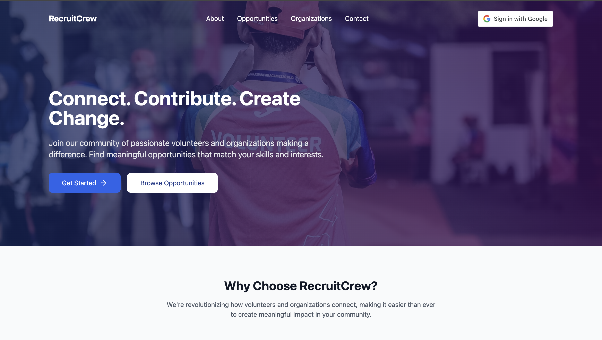
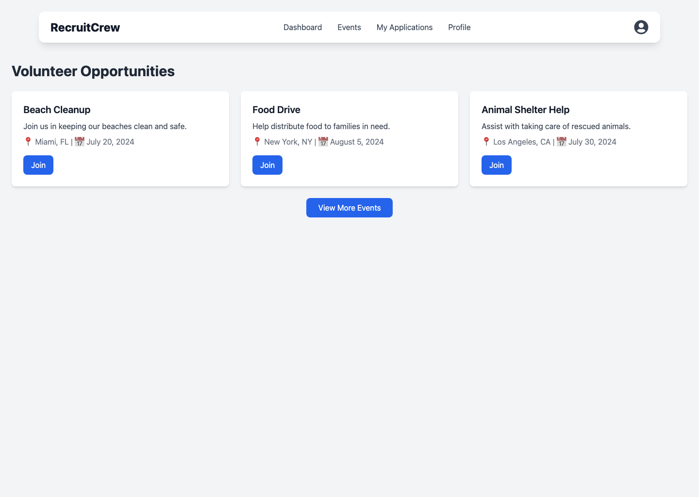
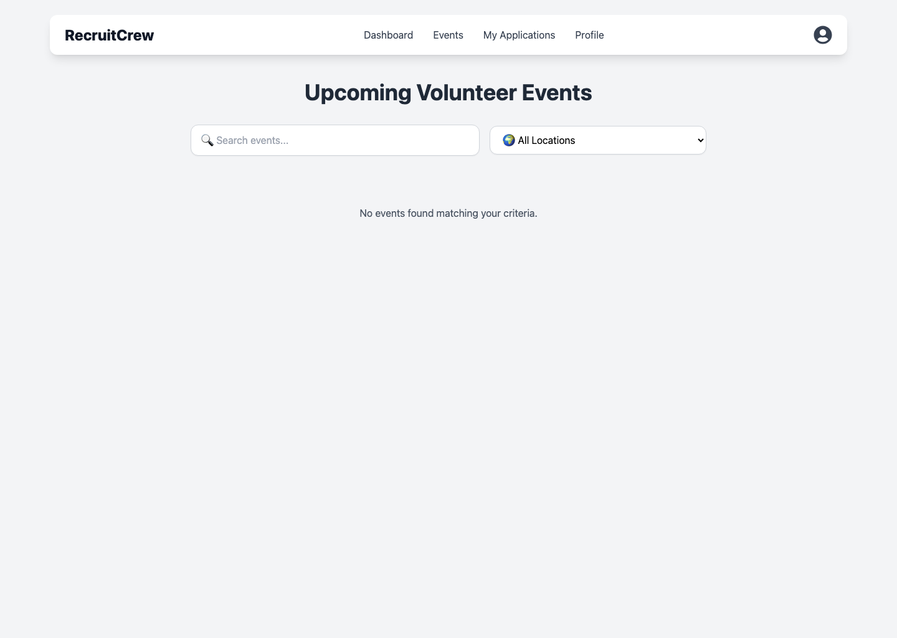
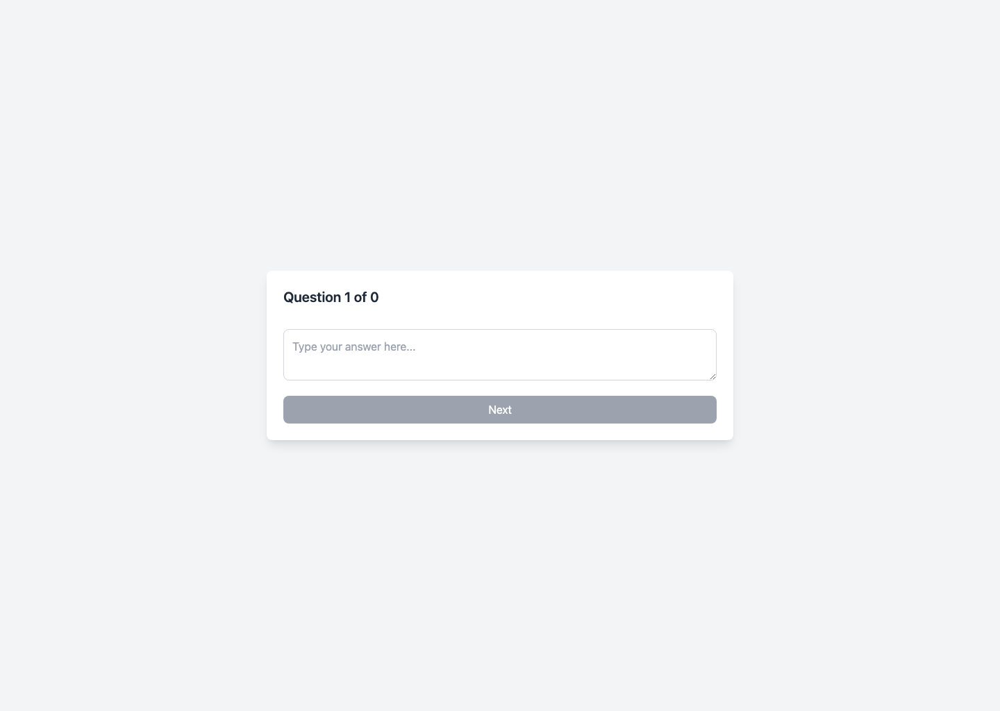

# Recruit Crew

Recruit Crew is a React and TypeScript recruitment platform that supports candidate, organization, and admin workflows in a single frontend application. It integrates with an AI backend for interview question generation and answer evaluation.



**Live demo:** https://recruit-crew.vercel.app

## Screenshots

### Dashboard


### Events


### AI Questions


## What this project does

- Lets candidates browse opportunities, apply, and manage their profile
- Provides interview question and evaluation flows powered by the AI backend
- Supports organization registration, job posting, and application review
- Includes admin routes for platform oversight and organization review

## Tech stack

- React
- TypeScript
- Vite
- React Router
- Tailwind CSS
- Framer Motion
- Google OAuth
- Axios

## Project structure

```text
recruit_crew/
|-- src/
|   |-- pages/                  # Candidate, organization, and admin screens
|   |-- components/             # Reusable UI building blocks
|   |-- services/               # API integration helpers
|   |-- hooks/                  # Reusable React hooks
|   |-- context/                # Shared app state providers
|   |-- types/                  # TypeScript types
|   |-- utils/                  # App helpers
|   |-- App.tsx                 # Main route map
|   |-- main.tsx                # Vite entry point
|-- public/
|-- package.json
|-- vite.config.ts
```

## Main routes

### Public
- `/`
- `/events`

### Candidate
- `/dashboard`
- `/profile`
- `/questions`
- `/apply/:eventId`
- `/event-details/:eventId`
- `/my-applications`
- `/video`

### Organization
- `/organization`
- `/organization-dashboard`
- `/organization-events`
- `/organization-addEvent`
- `/OrganizationReview`
- `/organization/pending`

### Admin
- `/admin-dashboard`
- `/admin-addEvent`
- `/admin-organization-review`

## Local setup

```bash
git clone https://github.com/Deepakraja03/recruit_crew.git
cd recruit_crew
npm install
npm run dev
```

## Environment variables

Create a `.env` file in the project root.

```env
VITE_GOOGLE_CLIENT_ID=your_google_client_id
VITE_API_URL=http://localhost:5000
VITE_BACKEND_AI_URL=http://localhost:5001
```

## Scripts

```bash
npm run dev
npm run build
npm run preview
npm run lint
```

## How it connects to the backend

This frontend depends on two service layers:

- the main application backend for auth, jobs, applications, and organization flows
- the AI backend in `recruit_crew_backend_ai` for question generation and answer evaluation
